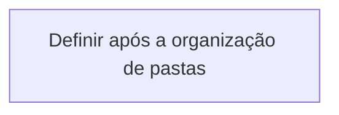

# 3.2 Visão de desenvolvimento

Descreve a organização do código-fonte, as camadas e as dependências entre módulos.

## Organização de pastas
TODO:

## Dependências entre módulos

```mermaid
flowchart TB
    TODO[Definir após a organização de pastas]
```
