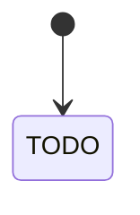

# 3.3 Visão de processo

Descreve concorrência, comunicação e fluxo de execução em tempo de execução.

## Processos e threads
TODO:

## Fluxo principal

```mermaid
stateDiagram-v2
    [*] --> TODO
```
