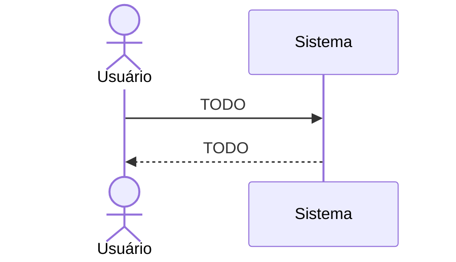

# 4. Diagrama de sequência

## Caso de uso 1: TODO

```mermaid
sequenceDiagram
    actor U as Usuário
    participant S as Sistema
    U->>S: TODO
    S-->>U: TODO
```

## Resumo
| Diagrama | Caso de uso | RF |
|---|---|---|
| 1 | TODO | RF01 |
